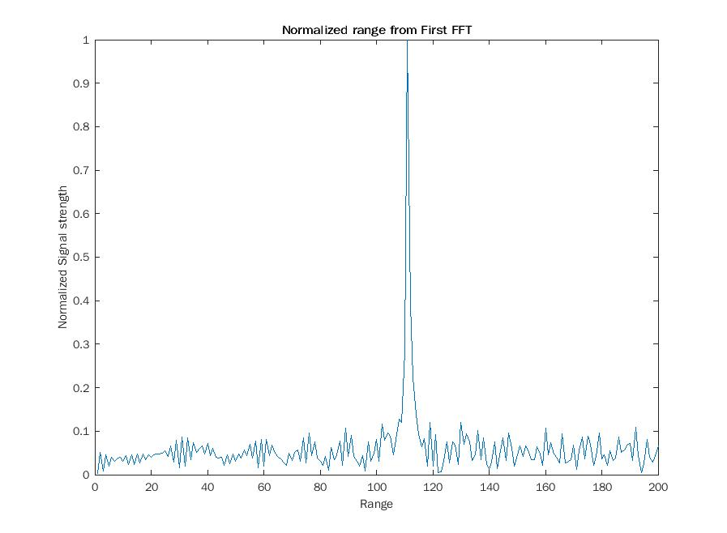
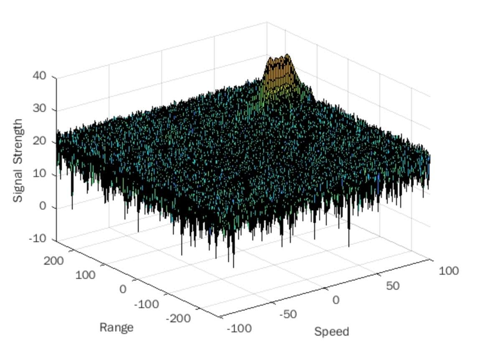
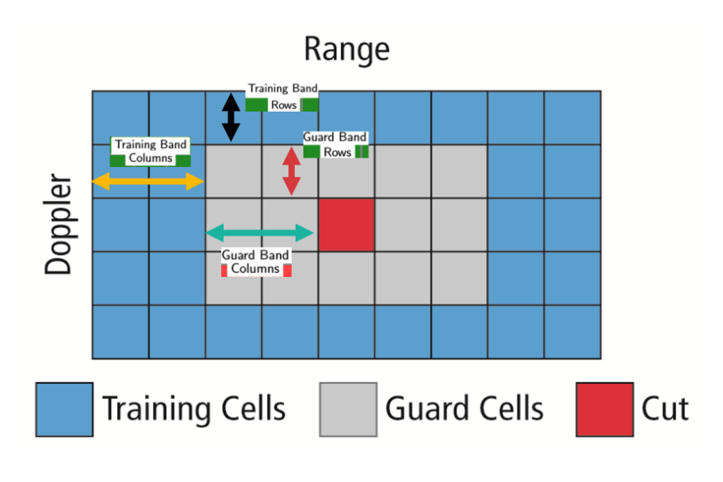
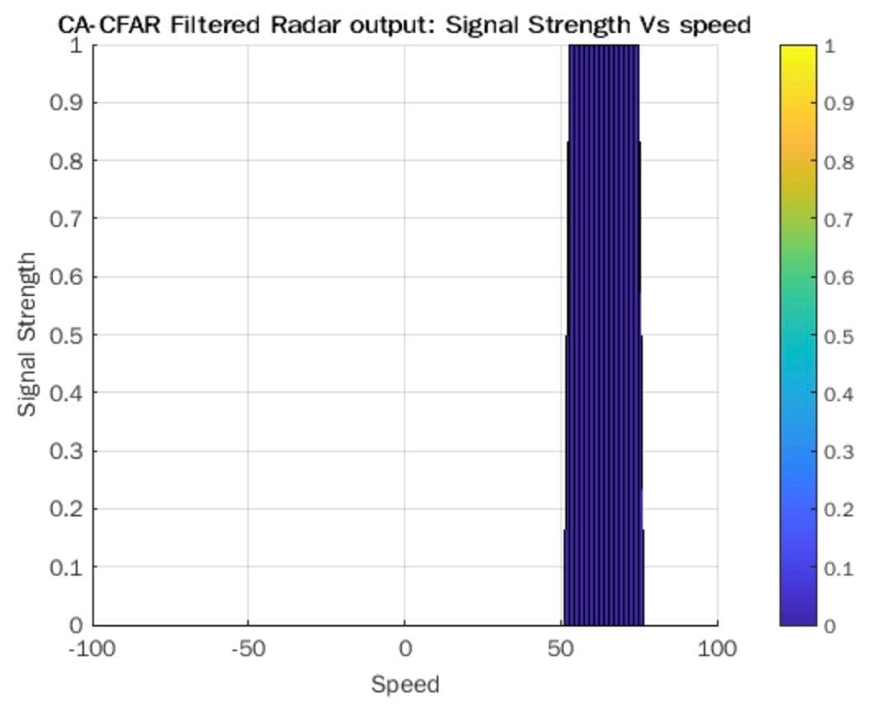

# Radar Target Generation and Detection

In this project 2D CA-CFAR (Cell-Averaging Constant False Alarm Rate) is implemented to detect a target in noisy environment with the help of a frequency modulated continuous wave (FMCW) radar.

The following image summaries the results of this project. On the left is the reading from the pre-processed FMCW radar readings. While on the right is the filtered radar output.

## Implementation
It was defined that the FMCW radar has the following properties
- **Radar Frequency** = 77GHz
- **Range Resolution** = 1m
- **Max Range** = 200m
- **Max velocity** = 70m/s
- **Velocity Resolution** = 3m/s

The object that needs to be detected by the radar has the following properties:
- **Distance** = 110
- **Velocity** = 70m/s

With the given specifications and the 5.5 sweep to round trip rule of thumb, the following were determined:
-   **Sweep bandwidth:**  150 MHz
-   **Chirp time:**  7.3333e-06 s
-   **Frequency drift / slope:**  2.045e13 Hz/s

The beat signal from this object is produced and the Fast Fourier Transform is used to determine the distance to the target. As can be observed in the normalised signal strength vs. range plot (produced by the first FFT) below, the resultant peak is found at **110m**.

>Range from first FFT: normalised signal strength vs. range plot  

With the help of the 2nd FFT, we can generate the second Range Doppler Map. In order to extract velocity and range information from this map while avoiding erroneous detentions due to noise, a dynamic thresholding filter needs to be deployed. For this project, the Constant False Alarm Rate (CFAR) filter has been selected.

>FFT2 surface plot: Amplitude vs Range vs Speed

##  Constant False Alarm Rate (CFAR)
The CFAR is a dynamic thesholding scheme which varies the detection threshold as a function of the 'local environment'.  It does this by comparing the radar bin in question (the Cell Under Test or CUT) with its local surrounding environment ( the training cells). It is though this comparison that the scheme determines the need to raise a detection alarm.

### CA-CFAR steps
1. Select the number of training and guard cells for each dimension, range and Doppler which will surround the CUT.
		- Training cells:
		- Guard cells:
2. Move the CUT across the entire matrix
3. Sum and convert (from decibels to power) the signal levels in the training cells
4. Average this reading and convert it back to decibels
5. Add an offset to this threshold
6. Compare the signal in the CUT to the this threshold
7. If the CUT level is greater than the threshold the cell is assigned a value of 1 else 0

### Training, Guard and offset

The 2D CA-CFAR is implemented over the range and Doppler data, the averaged sum of the training cells around the CUT cell is used to determine a threshold. If the CUT level is greater than the threshold the cell is assigned a value of 1 else 0.

> 2D CA-CFAR kernel: Allocation of bins around the CUT

After much experimentation the following parameters were selected:
-   Number of Training cells in range dimension (Tr) = 10
-   Number of Training cells in doppler dimension (Td) = 8
-   Number of Guard cells in range dimension (Gr) = 6
-   Number of Guard cells in doppler dimension (Gd) = 4
-   Offset = 1.4

## Suppression of non-threshold cells at edge
The process above will generate a thresholded block, which is smaller than the Range Doppler Map as the CUT cannot be located at the edges of matrix. Hence,few cells will not be thresholded. To keep the map size same set those values to 0 the following is used.

> RDM(RDM~=0 & RDM~=1) = 0

This equates all values which are neither 0 or 1 to equal 0.  

## Results
The following the estimates provided by the FMCW sytem:

